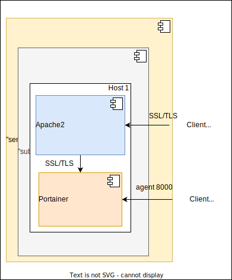

# Ansible playbook: labocbz.deploy_portainer


## Description


An Ansible playbook to deploy and configure a Portainer instance on your hosts.

This Ansible playbook offers a streamlined and automated approach to deploying and managing Docker containers, highlighting Portainer as a user-friendly interface. The inclusion of an Ansible playbook simplifies the entire process, from installing Docker to advanced configuration of Portainer, and optionally, setting up Apache2 as a local reverse proxy. This advanced Apache2 configuration provides features such as SSL, Authentication, LDAP, Quality of Service (QOS), and a web application firewall (WAF). By combining these elements, this Ansible playbook aims to streamline container management while ensuring a high level of security and compliance with best practices.

## Deployment diagramm



Here is a potential deployment scenario using the playbook. We can observe that Portainer is installed on the same host as Apache2, which then functions as an SSL/TLS reverse proxy, WAF, QoS, Auth, etc. Portainer is primarily used for administering other servers, which connect through the default client port 8000 and cannot be included in the reverse proxy.

## Tests and simulations

### Basics

You have to run multiples tests. *tests with an # are mandatory*

```MARKDOWN
# lint
# syntax
# converge
# idempotence
# verify
side_effect
```

Executing theses test in this order is called a "scenario" and Molecule can handle them.

Molecule use Ansible and pre configured playbook to create containers, prepare them, converge (run the playbook) and verify its execution.
You can manage multiples scenario with multiples tests in order to get a 100% code coverage.

This playbook contains a ./tests folder. In this folder you can use the inventory or the tower folder to create a simualtion of a real inventory and a real AWX / Tower job execution.

### Command reminder

```SHELL
# Check your YAML syntax
yamllint -c ./.yamllint .

# Check your Ansible syntax and code security
ansible-lint --config=./.ansible-lint .

# Execute and test your playbook
molecule lint
molecule create
molecule list
molecule converge
molecule verify
molecule destroy

# Execute all previous task in one single command
molecule test
```

## Installation

To install this playbook, just copy/import this playbook or raw file into your fresh playbook repository or call it with the "include_playbook/import_playbook" module.

## Usage

### Vars

```YAML
# From inventory
---
# all vars from to put/from your inventory
# see tests/inventory/group_var for all groups and vars.
```

```YAML
# From AWX / Tower
---
all vars from to put/from AWX / Tower
```

## Architectural Decisions Records

Here you can put your change to keep a trace of your work and decisions.

### 2023-11-13: First Init

* First init of this playbook with the bootstrap_playbook playbook by Lord Robin Crombez

### 2023-11-14: Deploy Done

* Playbook tested in PROD
* Install and configuration ok
* Added readme and schemas

### 2023-12-18: Iptables and system users

* Now you have to install Apache2 on the same host as Portainer
* Iptables rules handled to block without Apache2 / from another host
* Logs handled done

## Authors

* Lord Robin Crombez

## Sources

* [Ansible playbook documentation](https://docs.ansible.com/ansible/latest/playbook_guide/playbooks_reuse_playbooks.html)
* [Ansible Molecule documentation](https://molecule.readthedocs.io/)
